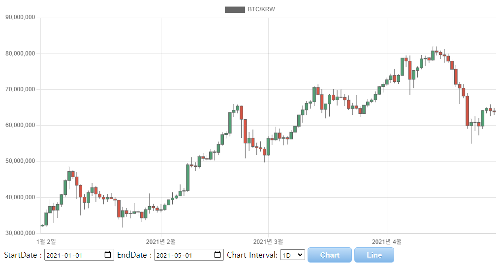
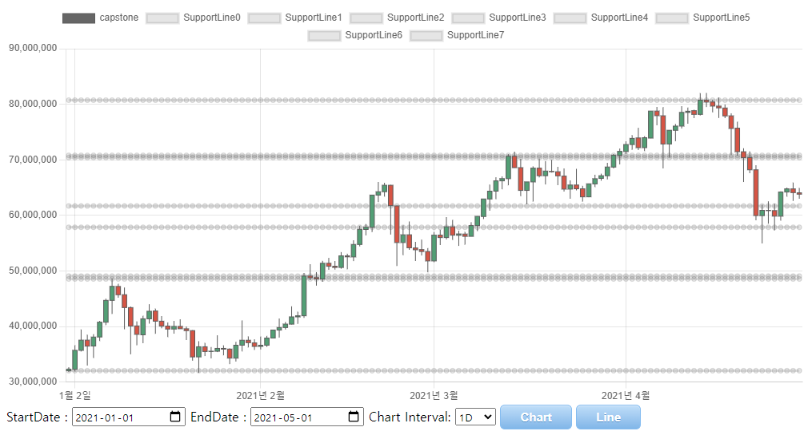

# CapstoneMars
System finds Support and Resistance Level

# Requirements
pip install -r requirements.txt

# How to use
1. run Django Server
> python manage.py runserver

2. select startDate, EndDate, and Chart Interval

3. press Chart Button

4. press Line Button

